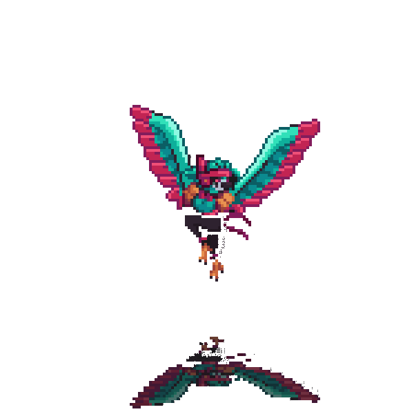

  <!--  -->

  

</img>

  

</img>

<code> Student | Developer | Learner </code> 
🎓 Informatics student in Universitas Trunojoyo Madura since of 2024  🛠️ Spending my days exploring **Web Dev**   📚 Currently compiling knowledge and leveling up my skills step-by-step  ⚡ Fun fact: I turn caffeine into code.

> *"Code. Break. Fix. Learn. Repeat."* 

</img>

  

  

    
    
    
    
    
    
    
  

  

    
    
    
    
    
    
    
  

  

    
    
    
    
    
    
    
  

 

  
  
  
  
    
  

</img>

  
  
  
  
  

</img>

